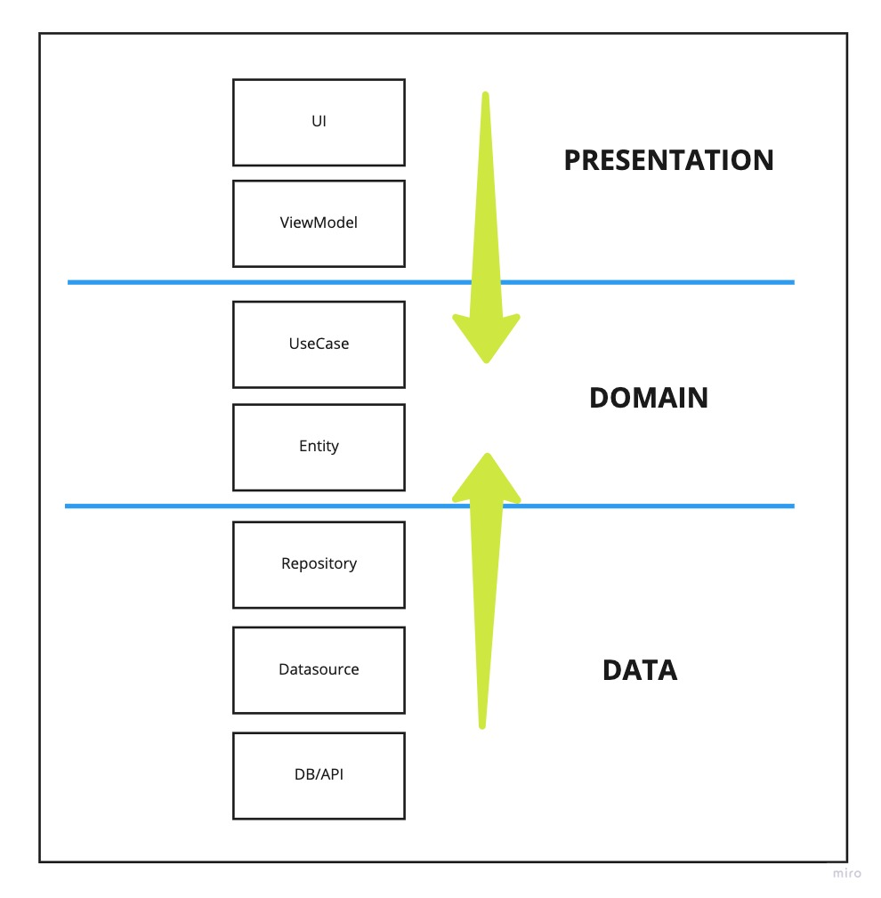

# 🎥 Ingresso Live

🚧  EM CONSTRUÇÃO 🚧 

O app ainda está em desenvolvimento e tem como intuito colocar em prática algumas ferramentas e
técnicas que estão em alta no mundo Android, além de aprender algumas skills. 

A ideia é que usemos os seguintes stack de componentes:

- [ ] Motion layout
- [ ] Navigation
- [ ] Coroutines
- [ ] ViewModel
- [ ] Single Activity
- [ ] Koin
- [ ] Mockk
- [ ] JUnit

## 💻  Configuração de ambiente

Primeiro de tudo, você vai precisar da versão 2021.1.1 (ou superior) do Android Studio e o Java 11.

## :house: Como foi pensada a arquitetura do projeto?

O projeto segue os conceitos da clean architecture, visando maior desacoplamento, facilidade na manutenção, estrutura de pacotes e módulos com responsabilidades bem definidas, aplicação altamente testável, etc.

Abaixo vemos a ligação entre as camadas da aplicação e a quais módulos cama uma pertence.

Arquitetura do app            |  Clean architecture
:-------------------------:|:-------------------------:
  |  

## 😄 Seja um dos contribuidores 

Quer fazer parte desse projeto? Abra uma PR com sua contribuição.

## 📝 Licença

Esse projeto está sob licença. Veja o arquivo [LICENÇA](LICENSE.md) para mais detalhes.

[⬆ Voltar ao topo](#-moovie) 

